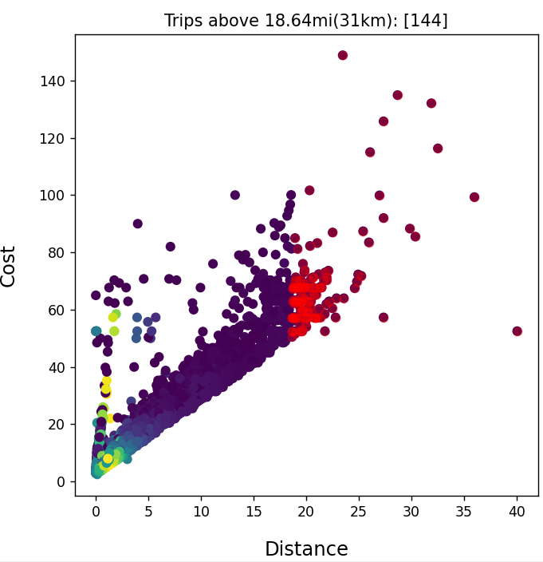

# [T1] Question:
What is the average revenue from trips <30km, <50km, >50 and non-restricted.

Metadata
- **Source** : https://chriswhong.com/open-data/foil_nyc_taxi/
- **Observations**: 15000
- New york is only **56.3km** from NE to SW and **21.5km** W to E so distances above 50km are unlikely

### Plot of the relationship between cost and distance
- **red** >30km
- **blue** < 30km

### Revenue
- [Unrestricted km] : $ 14.744 USD
- [<30km] : $ 13.935 USD
- [<50km] : $ 13.942 USD
- [>50km] : no trips were above 50km

### Distance 
- **Average distance** 3.328 km